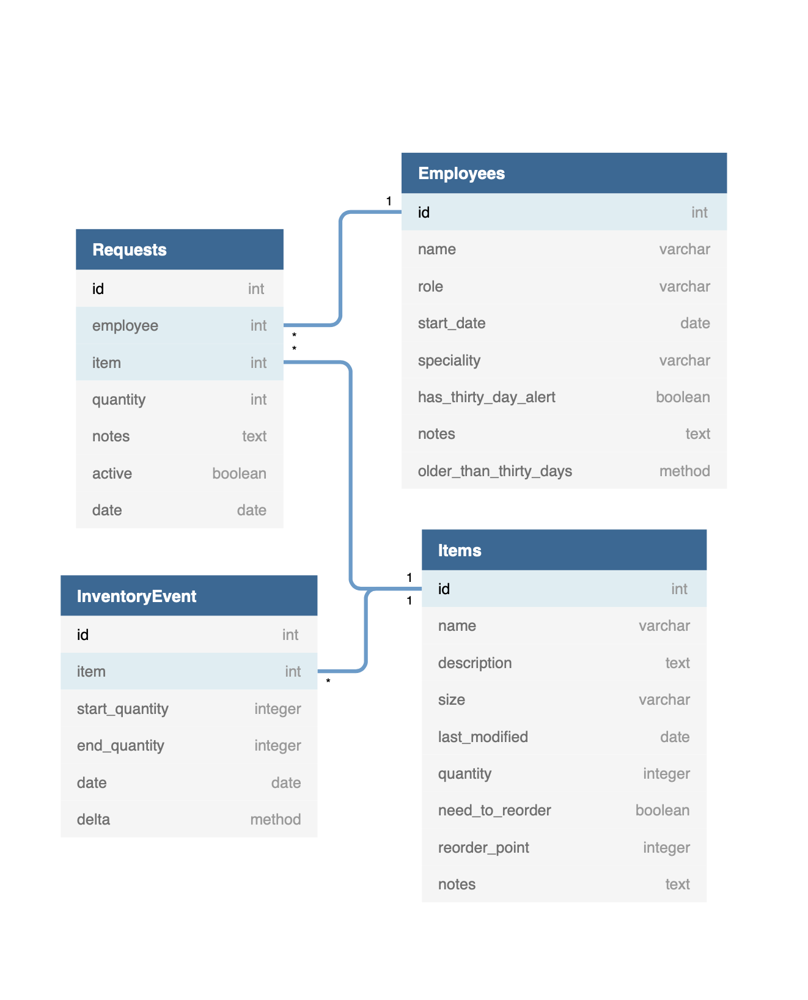

# Uniform Me

[www.uniformme.thefoundationworks.com](http://www.uniformme.thefoundationworks.com)

When I moved into my new role at The Foundation Works, one of my projects was to manage and distribute The Foundation Works uniforms. When I first joined, the existing process was very limited and required constant attention. 

I set out to solve that. I created this app as a way to accurately track  everything involved in the uniform pipeline such as inventory, managing requests, tracking employees, and providing pertinent info about uniform usage. Additionally, by hosting this as a web app, it enables other employees to easily access it and it becomes a more robust solution for the company.

Some of the issues we faced include

 - Tracking the inventory of uniforms
 - Tracking the usage of uniforms
 - Managing and tracking requests for uniforms
 - Tracking employee sizes
 - Providing uniforms to new employees once they hit their 30 day mark
 
 This app tackles all of these issues and is consistently used within The Foundation Works.

## The Tech
This app is built with a completely decoupled back and front end. The back end is built with **Django** and **Django REST** framework. It exposes an **API** for the **React/Redux** front end to securely consume. This was then served by **Gunicorn** and **Nginx**  on an Ubuntu server with the app processes managed by **systemd**.

## The Demo
When I first started the project, I was only thinking about The Foundation Works, and thus I didn't make the data have an 'owner'. In retrospect I should have done this, as it would have made the demo functionality simpler and the logic can scale better. But at the time I wasn't planning on building a scalable solution. Just a solution for The Foundation Works, so I didn't think it was necessary. But after I implemented the demo, I realized I should have done it this way. Anyways...

For the demo functionality, I originally planned on allowing **one** instance of the back end to communicate with two different databases, a production database and a demo database.  As I began implementing this I realized this wasn't the best approach because all of my generic views (most of the views in the app) were getting cluttered. You can only override `get_queryset` and write `Employee.objects.using('demo').all()` so many times before you rethink your approach. 

Instead, I created two instances of the app, each with their own Gunicorn service and a separate `systemd` process. From there, I set environment variables to select which database is accessed. By default, the front end consumes `/api` as the API endpoint. But when a `demo` cookie is present, the API endpoint switches to `/demo/api` and now the back end serves data from the demo database. 

## Database
This application is fairly straight forward on the database side. There are models for an `Employee`, `Item`, and `Request`. There is also an `InventoryEvent` model to track the history of each item.

