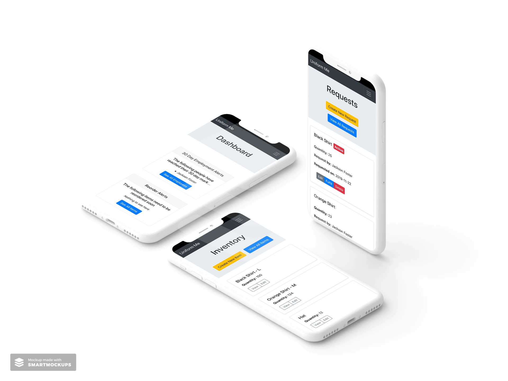

# Uniform Me

[www.uniformme.thefoundationworks.com](http://www.uniformme.thefoundationworks.com)

When I moved into my new role at The Foundation Works, one of my projects was to manage and distribute The Foundation Works uniforms. When I first joined, the existing process was very limited and required constant attention. 

I set out to solve that. This app was created as a way to accurately track everything involved in the uniform pipeline such as inventory, managing requests, tracking employees, and providing pertinent info about uniform usage. Additionally, by hosting this as a web app, it enables other employees to easily access it and it becomes a more robust solution for the company.

Some of the issues we faced include

 - Tracking the inventory of uniforms
 - Tracking the usage of uniforms
 - Managing and tracking requests for uniforms
 - Tracking employee sizes
 - Providing uniforms to new employees once they hit their 30 day mark
 
 This app tackles all of these issues and is consistently used within The Foundation Works.

## The Tech
This app is built with a completely decoupled back and front end. The back end is built with **Django** and **Django REST** framework. It exposes an **API** for the **React** front end to securely consume. This was then served by **Gunicorn** and **Nginx**  on an Ubuntu server with the app processes managed by **systemd**.

## Database
This application is fairly straight forward on the database side. There are models for an `Employee`, `Item`, and `Request`. There is also an `InventoryEvent` model to track the history of each item.

